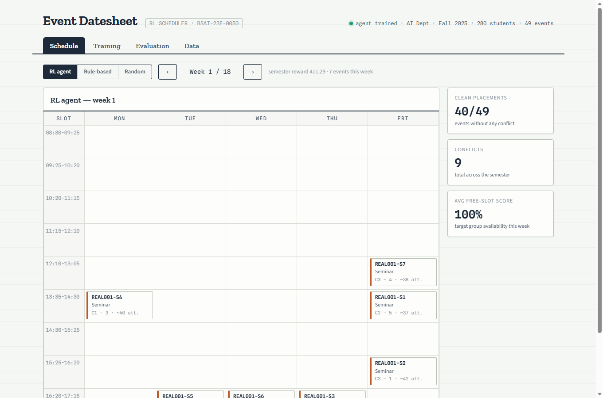

# AI-Powered Student Event Scheduling Using Reinforcement Learning

Semester project for Reinforcement Learning (BS AI, 6th semester) — a Q-Learning
agent that schedules university events inside a simulated university, compared
against random and rule-based baselines, with a web dashboard.

Muhammad Sudais Khalid · BSAI-23F-0050



## Architecture

- **backend/** — Python: Gymnasium environment, tabular Q-Learning agent,
  synthetic-data simulator, evaluation pipeline, FastAPI + WebSocket API.
  Storage: MongoDB at `localhost:27017` (database `event_scheduler`), with an
  automatic JSON-file fallback when Mongo is unreachable.
- **frontend/** — React (Vite) dashboard: weekly schedule datesheet, live
  training reward curve, evaluation comparison.

## Run

Backend (from `backend/`):

```
pip install -r requirements.txt
uvicorn app.main:app --port 8000
```

Frontend (from `frontend/`):

```
npm install
npm run dev
```

Open http://localhost:5173 — Schedule / Training / Evaluation tabs.
API docs: http://localhost:8000/docs

## Tests

```
cd backend && python -m pytest
```

## Real data (Department of AI, Fall 2025)

Drop the department's real timetables/venues/event plan into `real_data/`
(see `real_data/README.md`) and the backend auto-detects and parses them on
startup, replacing the synthetic simulator: `backend/simulator/import_real.py`
reads the aSc-Timetables semester-wise PDF (per-section class grids, used for
FR-04's free-slot intersection), the classroom-wise PDF (venue availability),
and the AI Innovation Society's semester plan PDF (real events → the RL
agent's action targets). The scheduling grid becomes the university's real
9-period day (08:30–17:15 Mon–Fri) instead of the synthetic 6-slot grid, and
events can span multiple consecutive periods (`duration_slots`).

New timetables/venues/event plans can also be uploaded from the dashboard's
**Data** tab at any time — each upload re-parses the whole real dataset and
invalidates the trained agent, so retrain afterwards from the Training tab.

## Results — synthetic data (10,000 episodes, 20-semester evaluation)

| Method | Reward | Attendance | Conflicts | Venue utilization |
|---|---|---|---|---|
| Random | 119 | 51.9% | 10.7 | 38.9% |
| Rule-based | 235 | 58.8% | 7.0 | 39.8% |
| **RL agent** | **253** | 57.2% | **5.0** | **48.2%** |

## Results — real Fall 2025 AI department data (8,000 episodes, 15-semester evaluation)

| Method | Reward | Conflicts |
|---|---|---|
| Random | 345 | 16.7 |
| Rule-based | 302 | 26.0 |
| **RL agent** | **406** | **9.0** |

Key hyperparameters: α = 0.1, γ = 0.4, ε-greedy 1.0 → 0.05. The low discount
factor outperforms γ = 0.95 because events interact only weakly (venue
occupancy and same-slot clashes), so long bootstrap chains mostly add variance.

See [PLAN.md](PLAN.md) for the full phased plan and MDP formalization.
